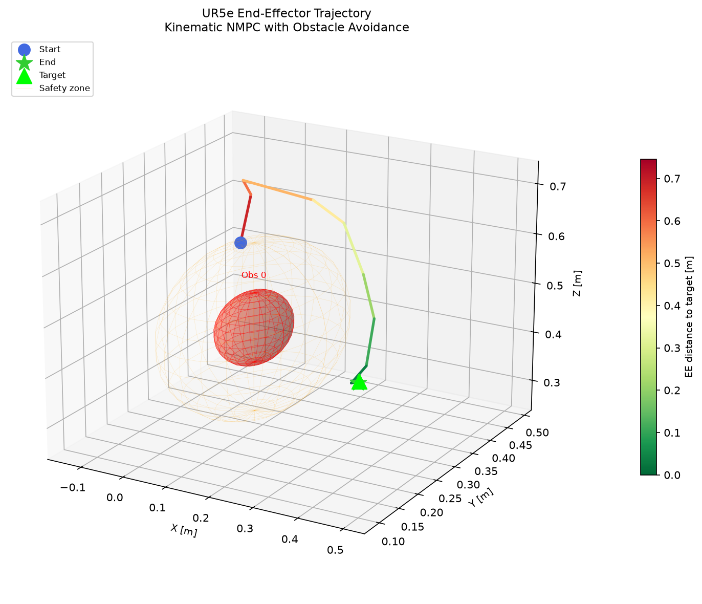
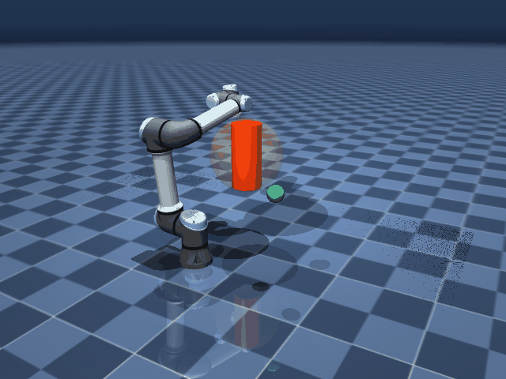
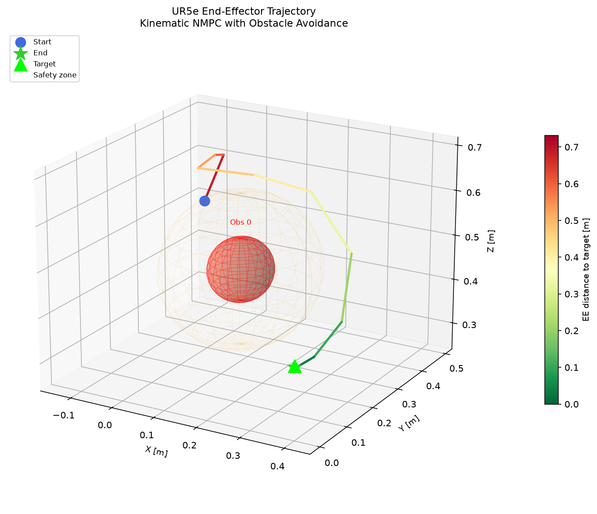
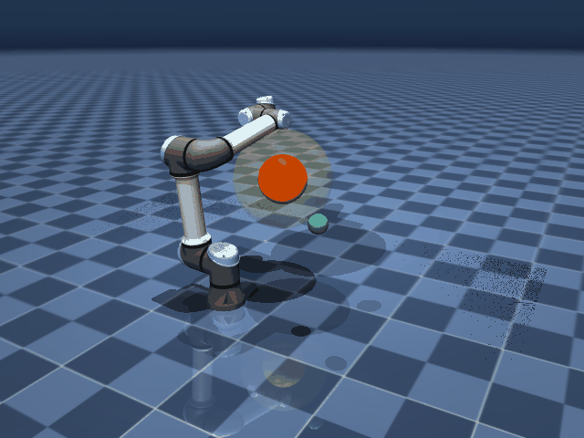
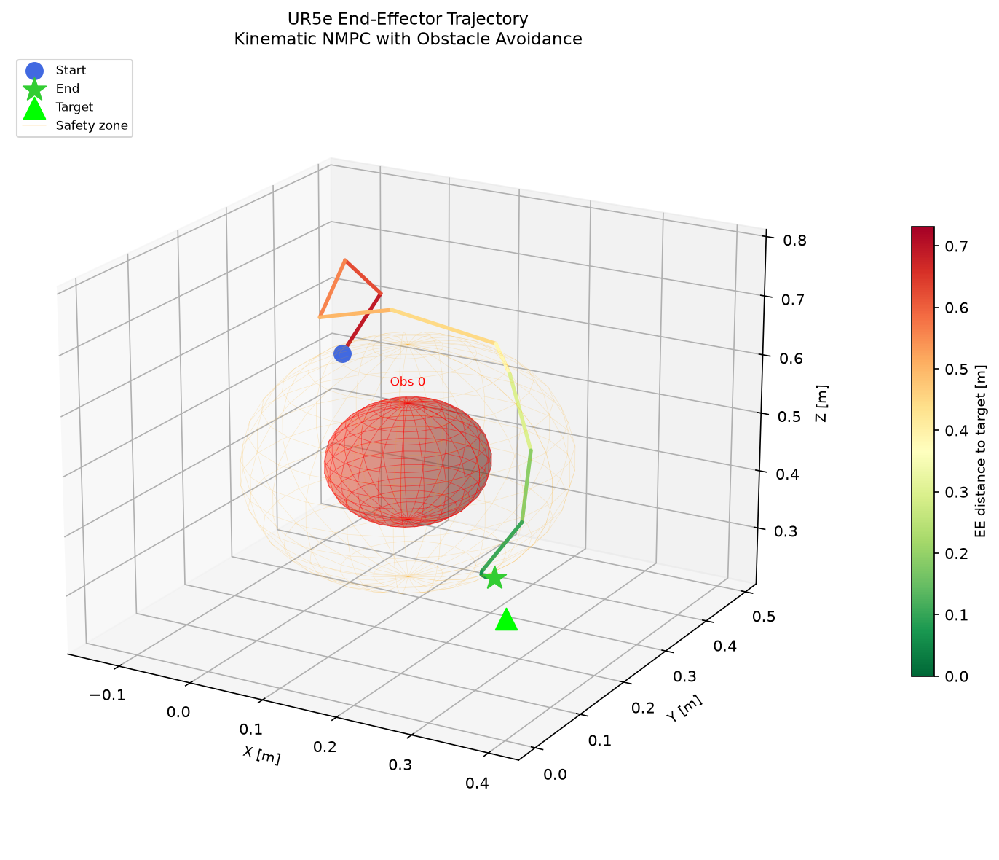
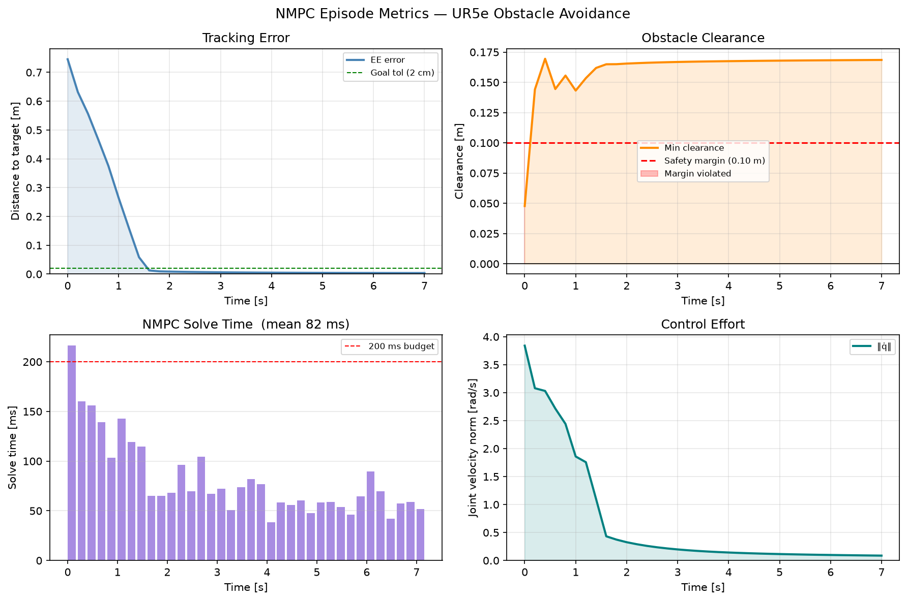
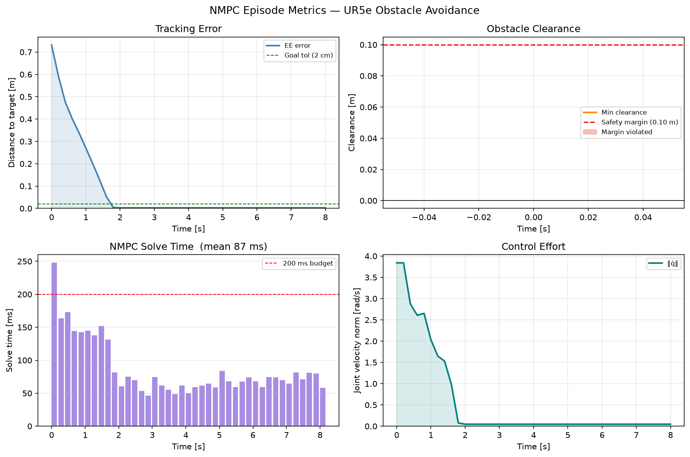

<div align="center">

# Vision-Based Dynamic Obstacle Avoidance for UR5e

**Kinematic NMPC · YOLOv8 · ArUco · MuJoCo · CasADi**

[](https://www.python.org/)
[](https://mujoco.org/)
[](https://web.casadi.org/)
[](https://github.com/ultralytics/ultralytics)
[](LICENSE)

A research-grade framework for **real-time dynamic obstacle avoidance** on a Universal Robots UR5e manipulator.  
Bottles are detected by a webcam using **YOLOv8**, localized in 3-D via **ArUco markers**, and fed into a  
**Kinematic NMPC** controller (CasADi + IPOPT) that drives the arm while keeping all links clear of obstacles.

</div>

---

## Table of Contents

- [Demo](#demo)
- [System Architecture](#system-architecture)
- [Features](#features)
- [NMPC Formulation](#nmpc-formulation)
- [Project Structure](#project-structure)
- [Installation](#installation)
- [Usage](#usage)
- [Baseline Comparison](#baseline-comparison)
- [UR5e Parameters](#ur5e-parameters)

---

## Demo

### NMPC Simulation — Static Obstacles

<div align="center">
  
  
</div>

---

### Moving Obstacle Avoidance

<div align="center">
  
  
</div>

---

### Sphere Obstacle Test

<div align="center">
  
  
</div>

---

### Method Comparison — NMPC vs APF vs RRT-Connect

<div align="center">

| NMPC (Proposed) | Artificial Potential Field | RRT-Connect |
|:---:|:---:|:---:|
|  |  |  |

</div>

---

## System Architecture

```
┌─────────────┐
│   Webcam    │
└──────┬──────┘
       │ raw frame
       ▼
┌─────────────────────┐
│  YOLOv8 Detection   │  → bottle bounding boxes + pixel centers
└──────┬──────────────┘
       │
       ▼
┌─────────────────────┐
│  ArUco Localization │  → world-frame position  [x, y, z] m
└──────┬──────────────┘
       │ obstacle_positions[]
       ▼
┌──────────────────────────────────────────┐
│         Kinematic NMPC                   │
│  state:   q  ∈ ℝ⁶  (joint angles)       │
│  control: q̇ ∈ ℝ⁶  (joint velocities)   │
│  horizon: N=10, dt=0.05 s               │
│  solver:  CasADi + IPOPT                │
└──────┬───────────────────────────────────┘
       │ joint velocity commands
       ▼
┌─────────────────────┐
│  MuJoCo Simulation  │  physics @ 500 Hz · control @ 5 Hz
└─────────────────────┘
```

---

## Features

| Feature | Details |
|---------|---------|
| **Kinematic NMPC** | CasADi + IPOPT, 10-step horizon, warm-started every cycle |
| **Full-body collision model** | Each UR5e link modelled as a capsule (shoulder → wrist_3) |
| **Soft obstacle constraints** | `w_obs · max(0, r_safe − d)²` — stays feasible in tight gaps |
| **Dynamic obstacles** | Positions updated every control tick; re-plans in ~100–300 ms |
| **Vision pipeline** | YOLOv8 nano detection → ArUco board back-projection → world frame |
| **Baselines** | APF (Artificial Potential Field) and bidirectional RRT-Connect |
| **Evaluation** | Tracks clearance, path length, solve time, success rate per episode |

---

## NMPC Formulation

**Prediction model** (kinematic integration):

$$q_{k+1} = q_k + \dot{q}_k \cdot \Delta t$$

**Cost function** minimised over horizon $N$:

$$J = \sum_{k=0}^{N-1} \Bigl[ w_{\text{track}} \|p_{ee}(q_k) - p_{\text{goal}}\|^2 + w_{\text{ctrl}} \|\dot{q}_k\|^2 + w_{\text{smooth}} \|\Delta\dot{q}_k\|^2 + w_{\text{obs}} \sum_i \max\!\bigl(0,\; r_{\text{safe}} - d_i(q_k)\bigr)^2 \Bigr] + w_{\text{term}} \|p_{ee}(q_N) - p_{\text{goal}}\|^2$$

| Weight | Value | Purpose |
|--------|------:|---------|
| `w_tracking` | 100.0 | End-effector position error |
| `w_ctrl` | 0.05 | Penalise joint velocity magnitude |
| `w_smooth` | 0.3 | Penalise velocity changes (jerk reduction) |
| `w_obstacle` | 1000.0 | Strong repulsion from obstacles |
| `w_terminal` | 300.0 | Terminal state accuracy |

**Constraints:**

$$\dot{q}_{\min} \leq \dot{q}_k \leq \dot{q}_{\max}, \quad q_{\min} \leq q_k \leq q_{\max}$$

---

## Project Structure

```
cvforRobot/
├── main.py                          # Entry point — sim / camera / compare
├── config.py                        # All tunable parameters (single source of truth)
├── nmpc_controller.py               # KinematicNMPC (CasADi + IPOPT)
├── ur5e_kinematics.py               # Symbolic FK, Jacobians, capsule model
├── mujoco_sim.py                    # UR5eSimulation MuJoCo wrapper
├── obstacle_localization.py         # VisionObstacleTracker (ArUco back-projection)
├── bottle_detector.py               # YOLOv8 + ArUco detection pipeline
├── baselines.py                     # APFController, RRTConnectPlanner
├── evaluation.py                    # EpisodeEvaluator, compare_methods()
├── plot_results.py                  # Trajectory & metrics plots
├── mujoco_menagerie .../
│   ├── ur5e.xml                     # UR5e Menagerie model (unchanged)
│   └── scene_obstacle_avoidance.xml # Extended scene — 5 mocap obstacle bodies
└── results/                         # GIFs, trajectory plots, metrics PNGs
```

---

## Installation

```bash
git clone <repo-url>
cd ur5e_pro

python -m venv myenv
source myenv/bin/activate          # Windows: myenv\Scripts\activate

pip install mujoco==3.9.0 casadi==3.7.2 scipy numpy matplotlib

# Camera mode (optional)
pip install opencv-python ultralytics
```

---

## Usage

```bash
source myenv/bin/activate
cd cvforRobot

# Simulation — NMPC with randomised obstacles (opens MuJoCo viewer)
python main.py

# Custom end-effector target [x y z] metres
python main.py --target 0.5 0.2 0.4

# Live webcam — YOLO + ArUco obstacle detection
python main.py --mode camera

# Headless benchmark — prints NMPC vs APF vs RRT table
python main.py --mode compare
```

---

## Baseline Comparison

| Metric | NMPC (Proposed) | APF | RRT-Connect |
|--------|:-:|:-:|:-:|
| Min obstacle clearance | **Best** | Medium | Medium |
| Path length | Near-optimal | Shortest | Longest |
| Solve time | 100–300 ms | < 1 ms | 50–500 ms |
| Dynamic re-planning | **Yes** | Yes | No |
| Success rate (dynamic) | **High** | Medium | Low |

<details>
<summary>Metrics plots</summary>

**NMPC**


**Camera mode**


</details>

---

## UR5e Parameters

| Parameter | Value |
|-----------|-------|
| DH `a` | `[0, -0.425, -0.3922, 0, 0, 0]` m |
| DH `d` | `[0.1625, 0, 0, 0.1333, 0.0997, 0.0996]` m |
| Max joint velocity | `[1.5, 1.5, 1.5, 2.0, 2.0, 2.0]` rad/s |
| Obstacle sphere radius | 0.07 m |
| Safety margin | 0.10 m |
| NMPC horizon | N = 10 × 0.05 s = 0.5 s |
| Control rate | 5 Hz |
| Physics timestep | 0.002 s (500 Hz) |

---
